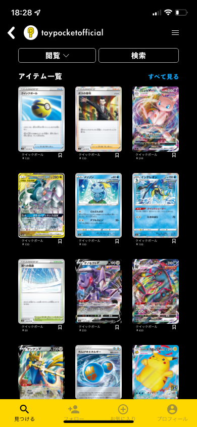

# Ren Aoki

 

<h3 align="left">Connect with me:</h3>

<h3 align="left">Tools:</h3>

     
  

# 経歴
神奈川県横浜市出身

2015.4 
   - 2017.6 Overseas Family School Singapore

2018.4 
   - 2022.3 青山学院大学地球社会共生学部 古橋研究室

2019.8 
   - 12 カセサート大学留学(タイ🇹🇭)

2021.6 
   - Toypocket: トレーディングカードゲームのプレイヤー向けコミュニティサービス「Caraby」を運営。 
   - TikTokアカウント「ポケカ豆知識」 https://www.tiktok.com/@pokekon15sec?_t=8cC4zxDNSq2&_r=1

2022.5 
   - SEOライティング、YouTube、Tiktokの動画編集/台本作成を受注。
   - カード販売/オリジナルパック販売(古物商 第451370013866号)

## ゼミ活動

## <2020年度>
### 主な活動
- OpenStreetMap マッピング https://tasks.hotosm.org/contributions
- PLATEAU活用
- 空間デザイン
- マスクコンペ 一次審査通過
- TEDxAoyamaGakuinU
  - 動画制作
  - MR空間制作
- [TikTok](https://www.tiktok.com/@vfofficials?_d=secCgYIASAHKAESPgo8tE5ZuEKmW%2F0zHu%2Bk0EYJ%2BuS7hhSbsENA6%2BfqN4hza%2BBlhNnve0%2F5QlnqiOolJzrhQv2jBjqM0MmFjXnRGgA%3D&checksum=a2f8aa315881ced381f3d9218580fe84673aca55920d55ff4c663e3e386cf050&language=ja&sec_uid=MS4wLjABAAAAVzn00wbTpHNVBUcFjVwNt-4l-N94_5oKs2SoVWZ4ge6F_5FwjUW7qxOdQPJm0-_5&sec_user_id=MS4wLjABAAAArF86hoaRhGs5wQg0ccRORElT3TX7UY4mu417ODuqnhA&share_app_id=1180&share_author_id=6981736136188789762&share_link_id=14AC604F-169D-4759-A0E3-F15C50BF34E1&tt_from=more&u_code=10gc9jggc&user_id=80759554207&utm_campaign=client_share&utm_medium=ios&utm_source=more&source=h5_t&_r=1)

### ゼミ論
[**「2020年度ゼミ論」タイトル：クロマキー撮影と編集における課題の整理と質の高い動画の撮影方法の提案**](https://github.com/furuhashilab/2020gsc_RenAoki-)

## <2021年度>
## 動画編集チーム V&F
### オンラインハッカソン2021

   

### オンラインハッカソン2022
- UNVT-Hackathon/Meetup https://github.com/furuhashilab/UNVT-Hackathon-Meetup-2022_V-F

### 古橋ゼミ/ゼミ論2020
- 「クロマキー撮影と編集における課題の整理と質の高い動画の撮影方法の提案」 https://github.com/furuhashilab/2020gsc_RenAoki-

### 古橋ゼミ/ゼミ論2021
- 「青山学院大学相模原キャンパスB棟413スタジオの照明機材のみで「クオリティの高い動画撮影」を提案」 https://github.com/furuhashilab/2021gsc_Ren-Aoki

## Toypocket
- トレーディングカードに特化したSNS "Caraby(カラビー)" の開発。現在はサービス終了。
- サービス名 : **Caraby(カラビー)**

  

- Caraby Shop: Carabyオリジナルパックや海外商品などを販売 https://caraby.base.shop/

## 宇宙業界への思い
宇宙への興味は中学時代からあり、特に仮面ライダーフォーゼに触れたことがそのきっかけでした。青山学院大学地球社会共生学部での研究を通じて地理空間情報に深く関わり、衛星データとその可能性に目覚めました。そして、ロケット、衛星通信、月面開発、火星移住など、宇宙に関連する多岐にわたるテーマに深い関心を持つようになりました。

現在、私の最大の興味はスペースマイニングです。未知の素材やエネルギー資源を探求し、その発見が人類の進化に寄与する可能性に心躍らせています。ダークマターやダークエナジーといった未解明の謎を解くことで、新たなエネルギー源を人類が使いこなして、さらに進化するところを見てみたい、今の私の夢です。

今は、衛星データを用いたビジネスの可能性を模索しています。私の目指すのは、これらの知識と技術を使って宇宙業界に新たな価値を提供することです。これまでOpenStreetMapに触れていたこともあり、月や火星でのデジタル地図整備も先駆けとなってやりたいと思っています。

具体的な事業プランはまだ形になっていませんが、トライ&エラーでアイデアを練り上げていきたいと考えています。最後に私の好きな言葉を貼っておきます。

「分からねえことにルールを探す。そのくっそ地道な努力を、科学って呼んでるだけだ。」 by 石神千空(Dr. STONE)
